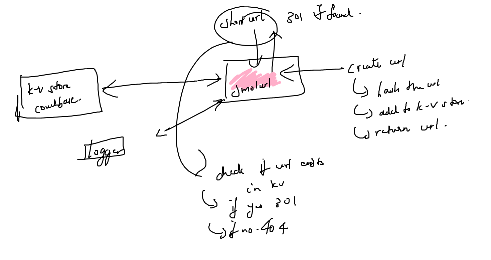

### Project Design Document

#### Metadata

- **Project Name**: SmolURL
- **Author(s)**: nn-advith
- **Created On**: 19-04-2025
- **Last Updated**: 10-05-2025
- **Version**: 0.0.1

---

#### Overview

SmolURL is a simple url shortner application, that shortens a given url and returns the new url.

---

#### Architecture

##### High-Level Design



SmolURL consists of three main modules: Application module, Hash Module and the KV Module. The client interacts with the application module (a web server) for generating the short urls and visiting the short urls. The application module interacts with the other modules ( and utility modules like the Logger ) to service the type of request from the client. The hashing module is used to generate the short url from the long url. The KV module handles the interactions with the database such as storage and retreival. Couchbase is the actual KV store ( Key-Document store would be more apt) with a simple schema enforced in the application level. The logger logs.

##### Component Breakdown

| Component          | Responsibility                         | Tech Stack | Notes |
| ------------------ | -------------------------------------- | ---------- | ----- |
| Logger             | Logging utility; file and stdout       | Go         |       |
| K-V Store          | Key-document store for the hashed urls | Couchbase  |       |
| KV Module          | Module to handle storage and retreival | Go         |       |
| Hash Module        | Generates short url from long url      | Go         |       |
| Application Module | Client-facing webserver; handles input | Go         |       |

##### Component Design

###### **Logger:**

Singleton design to enable usage form any module. Will be able to write logs to stdout and a log file, located at `%APPDATA%/smolurl/logs` on Windows and `~/.config/smolurl/logs/` on Linux. Can be controlled. Logger type is a struct with signature

```
type Logger struct {
    filelog     bool
    stdlog      bool
    logfilepath string
    logfile     *os.File
    logger      *log.Logger
}

Logger.Info(msg ...any)
Logger.Error(msg ...any)
Logger.Fatal(msg ...any)

```

###### **KV-Module:**

KV-Module works with the database and provides methods for Connection, Disconnection and CRUD operations. Design allows support for different types of NoSQL databases. The `DBInf` interface should be implemented in all database connectors.

```
type DBInf interface {
	Connect(collection string) error
	Disconnect() error
	Insert(collection string, data any) error
	Update(collection string, data any) error
	Read(collection string, id string) (any, error)
	Delete(collection string, id string) error
}
```

Couchbase is the current implementation. A datamodel for the entry in database is also defined within this module (Refer Data Model/Storage).

###### **Hash Module:**

Module to generate a hash from the long-url input. A single generate function is defined which uses the `SHA256` algorithm to hash the long-url and then encodes the result using `Base64` encoding of the last 8 characters. Salting is used to allow for regeneration in case of collisions.

###### **Application Module:**

The main application is a http web server with a few endpoints. Middlewares are also defined to allow for request processing and to provide database context. Should support graceful shutdown (with context and channels). The high level functionality of middleware and hashing/retreival logic is described below:

1. Generate hash:

   - Get long-url from request body
   - Generate slug using the hashmodule
   - Check if slug is present in db. If yes, check if the url of entry matches input url. If yes, return this slug without db update.
   - If slug present in db and url of entry doesnt match, regenerate the hash.
   - If slug not present in db, add new entry and return short url.

2. Visit hash:

   - Get the hash(slug) from the url
   - Check if slug present in db. If yes, check if TTL is valid. If invalid i.e expired, return 410.
   - If valid TTL, redirect to the long-url
   - If not present, client error response.

3. DB middleware

   ```
   type DBMiddleware struct {
   handler http.Handler
   db      kvmodule.DBInf
   }
   ```

   - Attach ServeHTTP method to db middleware and use the incoming request context alongside a key to use the dbinstance.
   - Method to retreive db context from request.

---

#### Data Model / Storage

The storage datamodel is a simple key-document model

```
"short-url-hash": {
    "_id": "short-url-hash"
    "longurl": "long-url value"
    "created": <timestamp in seconds>
    "ttl": <time in seconds>
}
```

The `short-url-hash` acts as the index for retreival operations. This schema is enforced in the application level.

Couchbase will be the choice of storage under bucket `SMOLURL`, scope `_default`, collection `urls`. Secure access to couchbase to be maintained with the help of users with only bucket level access.

**Application level struct**:

```
type UrlEntry struct {
	ID      string `bson:"_id" json:"_id"`
	LongURL string `bson:"longurl" json:"longurl"`
	Created int64  `bson:"created" json:"created"`
	TTL     int    `bson:"ttl" json:"ttl"`
}
```

---

#### API endpoints

| Method | Input                         | Output                                                      | Description                |
| ------ | ----------------------------- | ----------------------------------------------------------- | -------------------------- |
| POST   | body -> some long url         | 200 OK; smol url payload                                    | Generate URL from long url |
| GET    | smolurl hash as URL parameter | if valid -> 301 redirect to long url ;else -> 404 not found | Visit smolurl hash         |

---

#### Dependencies

- Couchbase - 7.6.5-5704

---

#### Failure Handling

| Failure case   | Description             | Handler                   |
| -------------- | ----------------------- | ------------------------- |
| Invalid input  | Malformed link          | 400 Bad Request           |
| Database down  | ehhh                    | 500 Internal Server Error |
| Hash collision | shorturl already exists | Retry                     |
| Expired url    | ttl passed              | 410 Done                  |

Log failures in file if necessary

---

#### Testing Plan

**Unit Tests**

Each function in the modules to be tested with simulated inputs. <u>To be updated</u>.

**Functional Tests**

Each feature to be tested for functionality; both positive and negative cases. <u>To be updated</u>.

---

#### Future Work

- Couchbase is not the ideal database for this application. It works but something like Redis is much more suited. Develop a module which allows utilisation of redis as a dataabase without breaking the existing couchbase implementation.
- Logger enum (or something) to allow for controlled log levels.
- Test cases.

---

#### Appendix

1. [Couchbase N1QL cheat sheet](https://docs.couchbase.com/files/Couchbase-N1QL-CheatSheet.pdf)
